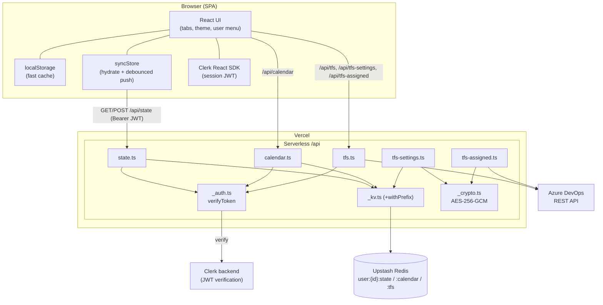
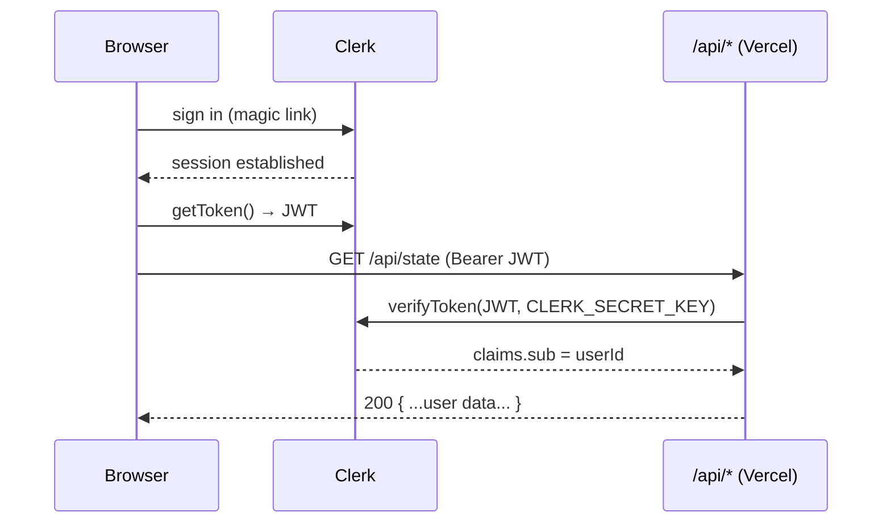
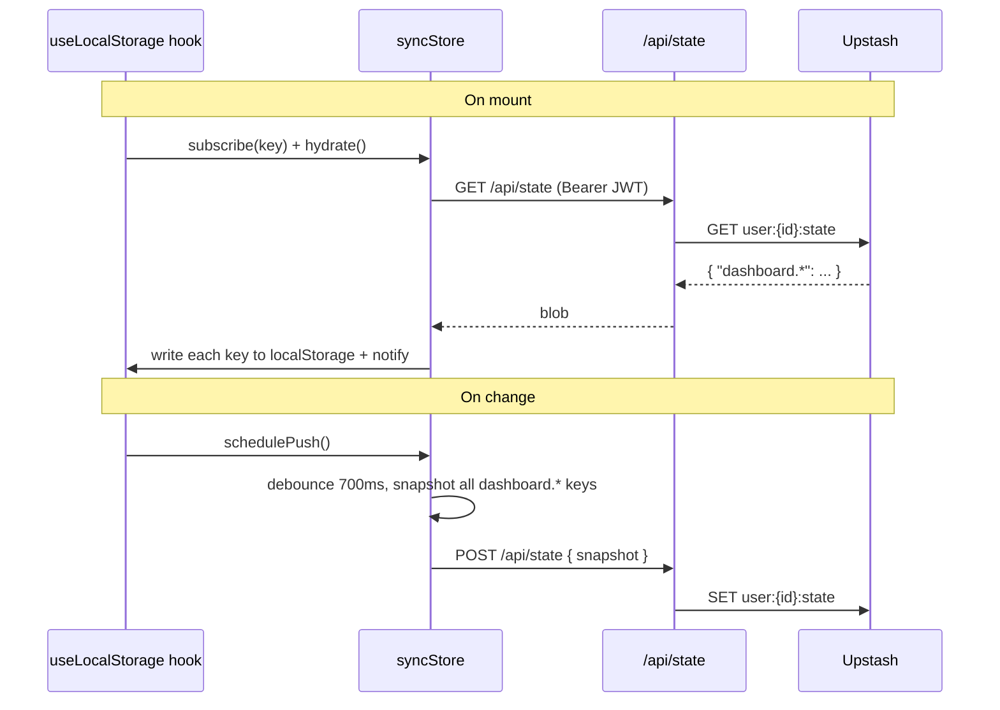
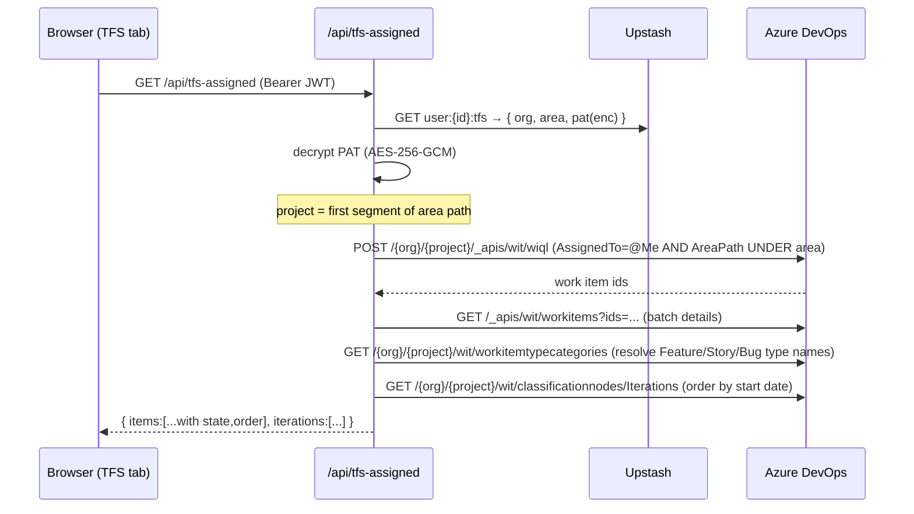

# Architecture

This document describes the complete architecture of the Personal Dashboard
application: its components, how they communicate, how data flows, and exactly
how data is stored in the database.

> Companion docs: [codebase.md](./codebase.md) (code walkthrough),
> [deployment.md](./deployment.md) (how it ships), [local-setup.md](./local-setup.md)
> (run it locally).

---

## 1. High-level overview

The product is a **single-page application (SPA)** with a thin **serverless API**
and a **key-value database**. There is no traditional backend server — the API is
a set of stateless functions.

| Layer | Technology | Responsibility |
|---|---|---|
| Client (SPA) | Vite 5 + React 18 + TypeScript | UI, local caching, optimistic updates |
| Auth | Clerk (email magic-link, invite-only) | Identity, session tokens (JWT) |
| API | Vercel Serverless Functions (`/api/*.ts`) | Auth verification, per-user storage, Azure DevOps proxy |
| Database | Upstash Redis (via `@vercel/kv`) | Per-user JSON blobs (state, calendar, TFS settings) |
| External | Azure DevOps REST API | Work-item lookup + assigned items |
| Hosting/CI | Vercel + GitHub Actions | Build, staging (Preview) & production deploys |



**Key idea:** every browser keeps a fast **localStorage cache**, but the
**source of truth is the database** (per user). On load the app *hydrates* from
the server; on change it *pushes* a snapshot back (debounced). This makes data
follow the user across browsers, devices, and incognito windows.

---

## 2. Authentication & identity

- Authentication is handled entirely by **Clerk** (email magic-link, invite-only).
- The React SDK issues a short-lived **session JWT** (~60s, silently refreshed).
- Every authenticated API call sends `Authorization: Bearer <jwt>`.
- On the server, [`api/_auth.ts`](../api/_auth.ts) calls Clerk's `verifyToken`
  with `CLERK_SECRET_KEY` and returns the user id (`claims.sub`). No valid token →
  `401`.
- The **user id** (e.g. `user_3HxIE67…`) is the partition key for all stored data.



---

## 3. Database structure (Upstash Redis / KV)

The database is a **key-value store**. Each value is a **JSON blob**. Data is
partitioned **per user** using the Clerk user id.

### 3.1 Key patterns

| Key | Value | Written by | Read by |
|---|---|---|---|
| `user:{userId}:state` | Dashboard state blob (JSON object) | `POST /api/state` | `GET /api/state` |
| `user:{userId}:calendar` | Calendar blob (JSON object) | `POST /api/calendar` | `GET /api/calendar` |
| `user:{userId}:tfs` | TFS connection settings (JSON, PAT encrypted) | `POST /api/tfs-settings` | `tfs.ts`, `tfs-assigned.ts`, `tfs-settings.ts` |

> **Staging namespace:** in the Preview (staging) environment an env var
> `KV_KEY_PREFIX=staging:` is set, and every key is prefixed by
> [`withPrefix()`](../api/_kv.ts). So staging keys look like
> `staging:user:{id}:state`. Production has **no** prefix. This lets **one**
> Upstash database safely host both environments (Upstash's free tier allows a
> single DB). Prod keys and staging keys never collide.

### 3.2 `user:{id}:state` — the dashboard state blob

This is a **flat JSON object** whose keys are the app's `dashboard.*`
localStorage keys and whose values are the parsed JSON of each. It contains
**everything except the calendar** (the calendar has its own key).

```jsonc
{
  "dashboard.tfs.boards":      [ { "title": "Sprint Board", "url": "https://dev.azure.com", "description": "..." } ],
  "dashboard.tfs.workitems":   [ { "id": 1201, "title": "...", "iteration": "Proj\\PI\\S2", "type": "User Story", "state": "Approved", "url": "..." } ],
  "dashboard.github.sections": [ [ { "id": "s-...", "title": "My Repos", "items": [ { "title": "react", "url": "https://github.com/facebook/react" } ] } ], [], [], [], [], [] ],
  "dashboard.infra.sections":  [ { "id": "aws", "title": "AWS", "items": [ { "title": "AWS Console", "url": "https://console.aws.amazon.com" } ] } ],
  "dashboard.portals.items":   [ { "title": "Office 365", "url": "https://www.office.com" } ],
  "dashboard.notes.sections":  [ { "id": "general", "name": "Notes", "pages": [ { "id": "welcome", "title": "Welcome", "html": "<p>...</p>", "date": "2026-08-16" } ] } ],
  "dashboard.activeSection":   "tfs",
  "dashboard.theme":           "dark",
  "dashboard.onboardingDismissed": true
}
```

Type reference (see [`src/data/links.ts`](../src/data/links.ts) and
[`src/components/sections/tfsUtils.ts`](../src/components/sections/tfsUtils.ts)):

```ts
type LinkItem   = { title: string; url: string; description?: string }
type WorkItem   = { id: number; title: string; iteration: string; type: string; state?: string; url?: string; order?: number }
type GhSection  = { id: string; title: string; collapsed?: boolean; items: LinkItem[] } // github.sections = GhSection[][] (6 columns)
type InfraSection = { id: string; title: string; items: LinkItem[] }
type NoteSection  = { id: string; name: string; collapsed?: boolean; pages: NotePage[] }
type NotePage     = { id: string; title: string; html: string; date?: string }
```

### 3.3 `user:{id}:calendar` — the calendar blob

Stored separately (its own endpoint) because it changes on a different cadence.

```jsonc
{
  "categories": [
    { "id": "pl", "name": "PL", "color": "#4f9cff" },
    { "id": "wfa", "name": "WFA", "color": "#a371f7" }
  ],
  "marks": {
    "2026-08-18": "pl",   // dateKey (YYYY-MM-DD) -> categoryId
    "2026-08-25": "wfa"
  }
}
```

### 3.4 `user:{id}:tfs` — TFS connection settings (secret encrypted)

```jsonc
{
  "org":  "ALMP-ORG-EP11",
  "area": "Healthcare IT\\CVI Reporting",
  "pat":  "aXY=.dGFn.Y2lwaGVy"   // AES-256-GCM  "iv.tag.ciphertext", each base64
}
```

- The **PAT is never stored in plaintext**. [`api/_crypto.ts`](../api/_crypto.ts)
  encrypts it with **AES-256-GCM**. The key is derived (`sha256`) from
  `TFS_ENC_KEY` (or `CLERK_SECRET_KEY` as a fallback).
- The stored string is `iv.tag.ciphertext` (three base64 parts joined by `.`).
- `GET /api/tfs-settings` **never** returns the PAT — only `{ configured, org, area }`.

---

## 4. Data flow: hydrate & push (state/calendar)

The client library [`src/lib/syncStore.ts`](../src/lib/syncStore.ts) keeps
localStorage and the server in sync for every `dashboard.*` key **except**
`dashboard.calendar.*` (the calendar syncs itself through `/api/calendar`).

- **Synced keys rule:** `key.startsWith('dashboard.') && !key.startsWith('dashboard.calendar.')`.
- **Hydrate (on first mount):** `GET /api/state` → for each key in the returned
  blob, write it into localStorage and notify subscribed hooks so the UI updates.
- **Push (on change, debounced ~700ms):** snapshot **all** synced keys currently
  in localStorage into one object and `POST /api/state`. Push always waits for the
  first hydrate so stale local data never overwrites fresher server data.



**In short — "how data is pushed and in what format":** the browser serialises
each `dashboard.*` value with `JSON.stringify`, collects them into a single
object keyed by the localStorage key name, and `POST`s that object as JSON to
`/api/state`. The server stores that object **verbatim** at `user:{id}:state`.
Reading reverses it.

---

## 5. Data flow: TFS assigned work items

The TFS tab shows work items **assigned to the signed-in user** in Azure DevOps,
scoped to a configured **Area path**. The heavy lifting is in
[`api/_tfscore.ts`](../api/_tfscore.ts).



Notes:
- **WIQL must be project-scoped** (`/{org}/{project}/…`); the org-level endpoint
  returns `404`. The project is derived from the area path's first segment.
- Type names (Feature / Story / Bug) are **auto-discovered per project** via work
  item type *categories*, so it works for Agile/Scrum/custom processes.
- Iterations are ordered by their **start date** (classification nodes) so groups
  sort chronologically (the UI shows current on top, earliest at the bottom).
- `@Me` in WIQL resolves to the identity that owns the PAT (the signed-in user).

---

## 6. Environments & configuration

Same code runs in every environment; behaviour differs only by **environment
variables** per Vercel environment.

| Variable | Where used | Notes |
|---|---|---|
| `VITE_CLERK_PUBLISHABLE_KEY` | **Build time** (client) | Baked into the JS bundle. **Must NOT be "Sensitive"** in Vercel (sensitive vars aren't exposed to the CLI build). |
| `CLERK_SECRET_KEY` | Runtime (server) | Verifies JWTs; also the default TFS encryption key source. |
| `KV_REST_API_URL` / `KV_REST_API_TOKEN` | Runtime | Upstash connection (read by `@vercel/kv`). |
| `KV_KEY_PREFIX` | Runtime | `staging:` on **Preview only**; empty/unset in Production. |
| `TFS_ENC_KEY` | Runtime | Dedicated AES key for PAT encryption (optional; falls back to `CLERK_SECRET_KEY`). |
| `OWNER_USER_ID` | Runtime | Owner-only convenience: enables the `AZDO_PAT`/`AZDO_ORG` fallback for TFS. |
| `AZDO_PAT` / `AZDO_ORG` | Runtime | Owner-only TFS fallback (never used by other users). |

> Build-time vs runtime is the crucial distinction: only `VITE_*` variables are
> compiled into the browser bundle; everything else is read by the serverless
> functions at request time.

---

## 7. Local development architecture

Locally there is **no Vercel and no Upstash**. The Vite dev server
([`vite.config.ts`](../vite.config.ts)) implements the `/api/*` routes as
middleware and stores each user's data as **JSON files on disk**:

```
data/users/{safeUserId}/state.json
data/users/{safeUserId}/calendar.json
data/users/{safeUserId}/tfs.json
```

- The user id is decoded from the Clerk JWT `sub` **without signature verification**
  (dev only — real verification happens on Vercel).
- The TFS routes call the **real Azure DevOps API** with the stored PAT, so the
  TFS features work fully in local dev.
- The `data/` folder is git-ignored, so nothing personal is committed.

This mirrors production's per-user isolation (files instead of KV keys), which is
why the app behaves the same locally and in the cloud.
