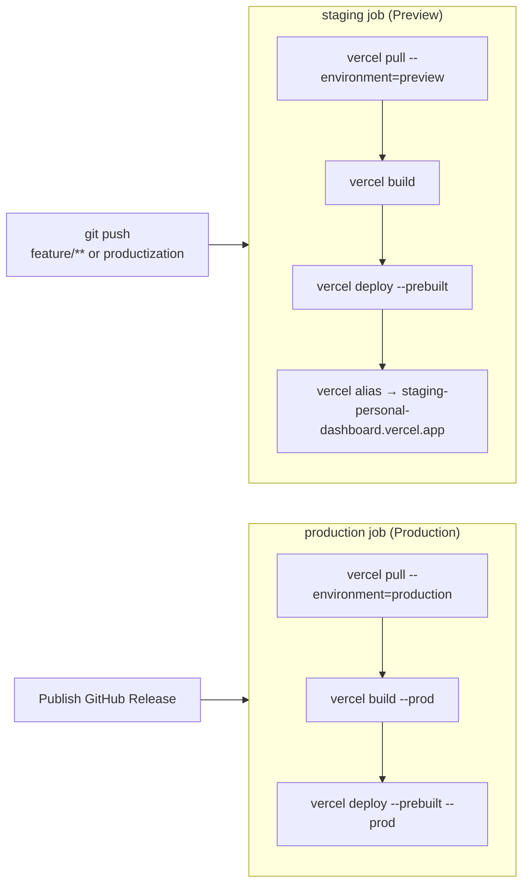
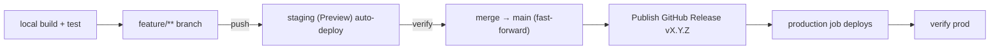

# Deployment & Environments

How Relax is built, where it runs, how staging and production
are separated, and exactly what happens on every push and release.

> Companion docs: [architecture.md](./architecture.md),
> [codebase.md](./codebase.md), [local-setup.md](./local-setup.md).

---

## 1. Where things run

| Concern | Provider |
|---|---|
| Hosting (SPA + serverless API) | **Vercel** (team `relax47`, project `personal-dashboard`) |
| Database | **Upstash Redis** (one DB, shared by prod + staging via key prefix) |
| Auth | **Clerk** |
| CI/CD | **GitHub Actions** (`.github/workflows/deploy.yml`) |
| Source | **GitHub** `reno47/Relax` |

There is **one** Vercel project. "Staging" is not a separate project — it is the
project's **Preview** environment. Environments are distinguished purely by
**per-environment environment variables**.

---

## 2. Environments

| Environment | Vercel env | Branch/trigger | Database namespace | Clerk keys |
|---|---|---|---|---|
| **Local** | — | your machine | JSON files in `data/users/` | dev instance |
| **Staging** | **Preview** | push to `productization` or `feature/**` | `staging:` key prefix (same Upstash DB) | dev instance |
| **Production** | **Production** | publishing a GitHub **Release** | no prefix (same Upstash DB) | dev/live instance |

**Key isolation:** the serverless code prefixes every KV key with
`process.env.KV_KEY_PREFIX` (`api/_kv.ts → withPrefix`). Preview sets
`KV_KEY_PREFIX=staging:`; Production leaves it unset. So:

```
Production:  user:{id}:state
Staging:     staging:user:{id}:state
```

They live in the same Upstash database but never collide. ⚠️ **`KV_KEY_PREFIX`
must be Preview-only** — if it is ever set on Production, prod would look for
`staging:` keys and appear to "lose" all data.

---

## 3. The deploy pipeline (`.github/workflows/deploy.yml`)

One workflow, two jobs, each gated by the trigger:

```yaml
on:
  push:
    branches: [productization, 'feature/**']   # → staging
  release:
    types: [published]                          # → production
```



- Both jobs deploy via the **Vercel CLI**, which **bypasses** Vercel's Git
  auto-deploy. The project's **Ignored Build Step** is set to `exit 0` so Vercel
  never auto-builds on push — this workflow is the single source of deployment
  truth.
- The **staging** job aliases each Preview deployment to a stable URL
  (`staging-personal-dashboard.vercel.app`) so testers always hit the same link.
- The **production** job only runs when a **Release is published**.

### Required GitHub secrets
`VERCEL_TOKEN` (scoped to the `relax47` team), `VERCEL_ORG_ID`,
`VERCEL_PROJECT_ID`. (Values come from `vercel link` → `.vercel/project.json`.)

---

## 4. Vercel environment variables

Set under **Vercel → Project → Settings → Environment Variables**, scoped per
environment.

| Variable | Production | Preview (staging) | Sensitive? |
|---|---|---|---|
| `VITE_CLERK_PUBLISHABLE_KEY` | ✅ | ✅ | ❌ **must NOT be Sensitive** (build-time) |
| `CLERK_SECRET_KEY` | ✅ | ✅ | ok |
| `KV_REST_API_URL` / `KV_REST_API_TOKEN` | ✅ | ✅ | ok |
| `KV_KEY_PREFIX` = `staging:` | ❌ | ✅ **Preview only** | — |
| `TFS_ENC_KEY` | ✅ (recommended) | ✅ | ok |
| `OWNER_USER_ID` | ✅ | ✅ | — |
| `AZDO_PAT` / `AZDO_ORG` | optional | optional | ok |

> **Why the "Sensitive" flag matters:** Vercel does not expose *Sensitive* env
> vars to `vercel pull` in CI. Because `VITE_CLERK_PUBLISHABLE_KEY` is baked into
> the browser bundle at build time, marking it Sensitive makes the CLI build
> receive an empty value → Clerk fails with "invalid publishableKey". Keep it
> non-sensitive (publishable keys are public anyway). Runtime-only secrets
> (`CLERK_SECRET_KEY`, PAT, KV token) can be Sensitive.

---

## 5. Release process (production)



Steps:
1. Develop on a `feature/**` branch; push → staging auto-deploys; test on
   `staging-personal-dashboard.vercel.app`.
2. Merge the branch into `main` (fast-forward). **Merging does not deploy.**
3. **Publish a GitHub Release** (tag `vX.Y.Z`, target `main`). This triggers the
   production job.
4. Verify production. Delete the merged feature branch.

### Versioning history (context)
- `v1.0.0` baseline, `v2.0.0` feature set.
- `v3.0.0` multi-tenant productization (Clerk auth, per-user isolation, owner
  data migration, sample data, per-user TFS PAT, staging).
- `v3.0.1` cleanup (removed one-time migration code + old global KV keys).
- `v3.0.2` removed the in-app feedback button.
- `v3.1.0` profile menu + light theme.
- `v3.2.0` TFS assigned work items + filters + state chips.

---

## 6. Staging data & rehearsal tooling

Because staging shares the Upstash DB (behind the `staging:` prefix), several
scripts help manage it (run with the KV credentials set in your shell):

| Task | Command |
|---|---|
| Seed synthetic data for a staging user | `npm run seed:staging` (reset: `node scripts/seed-staging.mjs --reset`) |
| Rehearse a data migration into staging | `npm run rehearse:migration` |
| Back up legacy global keys | `npm run backup:global` |
| Delete legacy global keys | `node scripts/delete-global.mjs --confirm` |

---

## 7. Rollback

- **Fast path:** in the Vercel dashboard, open **Deployments**, find a previous
  healthy **Production** deployment, and **Promote/Rollback** to it.
- **Via release:** re-publishing (or re-running the production job for) an earlier
  release rebuilds that commit.
- Data is stored per-user in Upstash and is independent of the app version;
  rolling back the code does not roll back user data.

---

## 8. Observability & troubleshooting

- **Build/deploy logs:** GitHub → **Actions** → the *Deploy* workflow run.
- **Runtime (function) logs:** Vercel → the deployment → **Logs** (Runtime). This
  is where `/api/*` errors (e.g. `ERR_MODULE_NOT_FOUND`, Azure `404`) surface.
- **Client errors:** the browser console (e.g. Clerk key problems).

Common issues and causes:

| Symptom | Likely cause |
|---|---|
| "invalid publishableKey" in the browser | `VITE_CLERK_PUBLISHABLE_KEY` missing/malformed or marked **Sensitive**; rebuild after fixing. |
| `/api/*` 500 `ERR_MODULE_NOT_FOUND` | A relative import in `api/` missing the `.js` extension (ESM). |
| Prod shows no data after deploy | `KV_KEY_PREFIX` accidentally set on Production. |
| TFS assigned empty, `wiqlStatus: 404` | Wrong org slug, or WIQL called org-level (must be project-scoped). |
| Staging job didn't run on push | Branch not matching `feature/**` / `productization`, or missing Vercel secrets. |

> Do **not** commit compiled artifacts. `api/*.js` and `api/*.d.ts` are
> git-ignored; if the TS project ever emits them, remove them (a stale
> `api/_tfscore.js` can shadow the `.ts` at build time).
